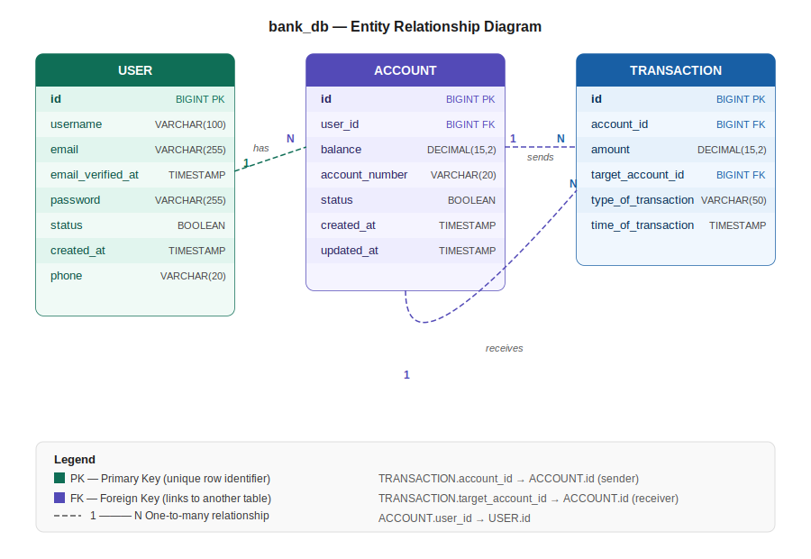
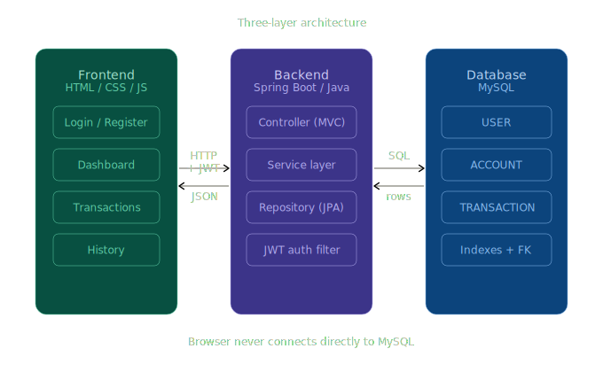

# Bank_Account_Management

> A web-based bank account management system built with Spring Boot, 
> allowing users to register, manage accounts, and perform transactions.

## 🛠 Tech Stack
- **Java**: 21
- **Framework**: Spring Boot 4.0.6
- **Database**: MySQL
- **Build Tool**: Maven
- **Other**: Lombok

## 📋 Prerequisites
Before running this project, ensure you have:
- JDK 21 or higher installed
- MYSQL installed and running
- Maven installed (optional — Maven wrapper included)

## 🚀 Getting Started

### 1. Clone the repository
```bash
git clone https://github.com/your-username/your-repo.git
cd your-repo
```

### 2. Configure Database
Update the src/main/resources/application.properties (or .yml) file with your database credentials:

```properties

spring.datasource.url=jdbc:mysql://localhost:3306/bank_db
spring.datasource.username=your_username
spring.datasource.password=your_password
spring.datasource.driver-class-name=com.mysql.cj.jdbc.Driver
# Enable SQL script execution
spring.sql.init.mode=always
spring.sql.init.schema-locations=classpath:docs/sql/db_schema.sql

# JPA/Hibernate
spring.jpa.hibernate.ddl-auto=update
spring.jpa.show-sql=false
spring.jpa.open-in-view=false

# Clean logging
logging.level.root=INFO
logging.level.org.springframework=INFO
logging.level.org.hibernate=WARN
```
### 3. Run the Application

If you have Maven installed locally:
```bash
mvn spring-boot:run
```

If you prefer the built-in Maven wrapper (no local install needed):
```bash
# macOS / Linux
./mvnw spring-boot:run

# Windows
mvnw.cmd spring-boot:run
```


## 🗄 Database schema & diagrams

All diagrams are in `docs/diagrams/`.

### Entity relationship diagram


### System architecture


### Login & registration flow


> The SQL schema file is at `src/main/resources/docs/sql/db_schema.sql`


